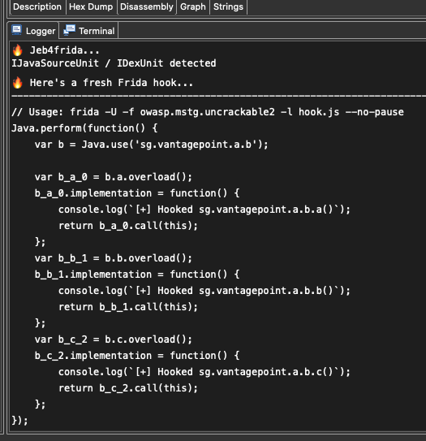
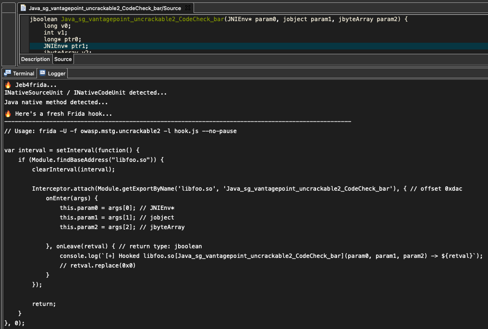

# JEB4Frida
Generate Frida hooks directly from JEB!

## How to use
1. Copy the `Jeb4frida.py` python script in JEB's `scripts` folder.
2. Open the target APK in JEB GUI (Command line usage is not supported).
3. After analysis of the APK, look for a target to generate hooks for.
4. Put the cursor a class or a method you want to create a hook for. This can be done in the disassembly view or decompiler view (both Java and native functions are supported).
5. Run the script: File > Scripts > Registered > Jeb4Frida.py .
6. Subsequent calls to the script might be done using the CMD+F2 command or by adding a shortcut (see third line of script).
7. If the cursor is set on a method, a hook is created for that method alone while if the cursor is set on a class, hooks are generated for each method in that class.

## TODO
- `<clinit>` calls are currently not hooked. If you know how to do this, send PR.
- Fix obfuscated names that make use of "weird" unicode characters.

## Naming
Some time ago, [jeb2frida](https://github.com/Hamz-a/jeb2frida) was released. Since that name was already taken and jeb3frida does not make much sense either, jeb4frida was chosen!

## Preview

1. Select target

2. Use script to generate hook

3. Native functions are also supported

